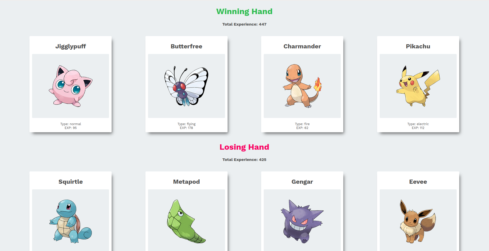
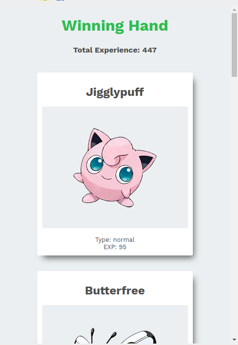

## Pokemon-game

A  pokemon web-app build with reactjs.

## Installation via github:
1. Clone the github project.
2. `cd Pokemon-game-master`
3. Run `npm install`

## Development mode
````
npm start
````
Go to `localhost:3080` to view the Todo app.

## Pokemon game screenshots



# Mobile view

